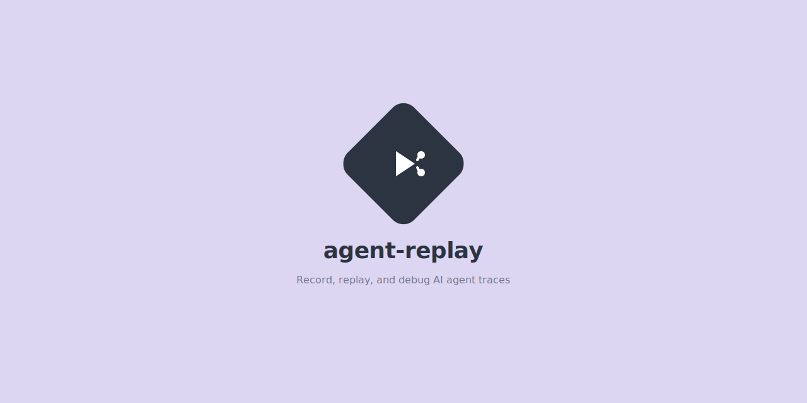

<p align="center">
  
</p>

# agent-replay

[](https://pypi.org/project/agent-replay/)
[](https://python.org)
[](LICENSE)
[](https://github.com/manasvardhan/agent-replay/actions)

**AI agents are black boxes. agent-replay makes them transparent.**

Record every LLM call, tool use, decision point, and state change during agent execution. Replay them step-by-step. Diff two runs to find exactly where behavior diverged.

## Features

- 🎬 **Record** agent runs with a simple context manager or decorator
- ⏯️ **Replay** traces step-by-step in the terminal
- 🔍 **Diff** two traces to find divergence points
- 🌳 **Tree view** of nested spans and events
- 📊 **HTML export** with a self-contained dark-mode timeline
- 🧩 **Structured traces** with spans, events, and metadata
- ⌨️ **CLI** for quick inspection without writing code
- 🐍 **Typed Python 3.10+** with zero heavy dependencies

## Architecture

```
Agent Run ──> Recorder ──> Trace File (.jsonl) ──> Replay Viewer
                                                 ──> Diff Tool
                                                 ──> HTML Export
```

```
┌─────────────────────────────────────────────────────────────┐
│  Your Agent Code                                            │
│  ┌───────────────────────────────────────────────────────┐  │
│  │  with Recorder("my-agent") as rec:                    │  │
│  │      with rec.span("planning"):                       │  │
│  │          rec.llm_request(model="gpt-4", ...)          │  │
│  │          rec.llm_response(content="...", tokens=42)   │  │
│  │      with rec.span("tool-use"):                       │  │
│  │          rec.tool_call("search", {"q": "..."})        │  │
│  │          rec.tool_result("search", {...})              │  │
│  └───────────────────────────────────────────────────────┘  │
└──────────────────────────┬──────────────────────────────────┘
                           │
                           ▼
                    trace.jsonl
                           │
              ┌────────────┼────────────┐
              ▼            ▼            ▼
         agent-replay  agent-replay  agent-replay
           show          replay        diff
```

## Quick Start

```bash
pip install agent-replay
```

```python
from agent_replay import Recorder

with Recorder("my-agent", output_path="trace.jsonl") as rec:
    with rec.span("planning"):
        rec.llm_request(model="gpt-4", messages=[{"role": "user", "content": "Hello"}])
        rec.llm_response(content="Hi there!", tokens=5)
    with rec.span("tool-use"):
        rec.tool_call("search", {"query": "python docs"})
        rec.tool_result("search", {"url": "https://docs.python.org"})
```

Then inspect it:

```bash
agent-replay show trace.jsonl
agent-replay show trace.jsonl --tree
agent-replay replay trace.jsonl
```

## Terminal Viewer

```
╭──────────── Agent Trace ────────────╮
│ my-agent                            │
│ ID: a1b2c3d4e5f67890                │
│ Spans: 2 | Events: 4               │
│ Duration: 1.234s                    │
╰─────────────────────────────────────╯

>>> planning (0.523s)
  🧠 LLM REQUEST  model=gpt-4 messages=1
  💬 LLM RESPONSE "Hi there!" (5 tokens)

>>> tool-use (0.711s)
  🔧 TOOL CALL search({"query": "python docs"})
  📦 TOOL RESULT search -> {"url": "https://docs.python.org"}
```

## Recording

### Context Manager

```python
from agent_replay import Recorder

with Recorder("my-agent", output_path="trace.jsonl") as rec:
    with rec.span("step-1"):
        rec.llm_request(model="gpt-4", messages=[...])
        rec.llm_response(content="...", tokens=10)
        rec.decision("next action", choice="search")
        rec.tool_call("search", {"q": "test"})
        rec.tool_result("search", {"results": [...]})
        rec.state_change("status", old="planning", new="executing")
```

### Decorator

```python
from agent_replay import record_trace, Recorder

@record_trace("my-agent", output_path="trace.jsonl")
def run_agent(task: str, recorder: Recorder = None):
    with recorder.span("work"):
        recorder.llm_request(model="gpt-4")
        recorder.llm_response(content="done")
```

### Event Types

| Event | Method | Description |
|-------|--------|-------------|
| `llm_request` | `rec.llm_request()` | LLM API call with model and messages |
| `llm_response` | `rec.llm_response()` | LLM response with content and token count |
| `tool_call` | `rec.tool_call()` | Tool invocation with name and arguments |
| `tool_result` | `rec.tool_result()` | Tool return value |
| `decision` | `rec.decision()` | Agent decision point with chosen action |
| `state_change` | `rec.state_change()` | State mutation with old/new values |
| `error` | `rec.error()` | Error with message and exception info |
| `log` | `rec.log()` | General log message |

## Replay

Step through traces interactively in the terminal:

```bash
agent-replay replay trace.jsonl
```

Commands during replay:
- `n` / `next` - advance one step
- `p` / `prev` - go back one step
- `j N` / `jump N` - jump to step N
- `q` / `quit` - exit

Programmatic replay:

```python
from agent_replay import ReplayEngine

engine = ReplayEngine.from_file("trace.jsonl")
while engine.has_next():
    span, event = engine.step()
    print(f"[{span.name}] {event.event_type.value}")
```

## Diffing

Compare two traces to find where agent behavior diverged:

```bash
agent-replay diff trace_a.jsonl trace_b.jsonl
```

```
╭───────────── Trace Diff ─────────────╮
│ Trace A: a1b2c3d4                    │
│ Trace B: e5f6a7b8                    │
│ Found 2 divergence(s): 1 critical,   │
│ 1 informational.                     │
╰──────────────────────────────────────╯
┌──────────────── Divergences ────────────────┐
│ # │ Severity │ Pos │ Description            │
├───┼──────────┼─────┼────────────────────────┤
│ 1 │ CRITICAL │ 3   │ Different tool called:  │
│   │          │     │ search vs browse        │
│ 2 │ INFO     │ 5   │ LLM response content   │
│   │          │     │ differs                 │
└───┴──────────┴─────┴────────────────────────┘
```

Programmatic diffing:

```python
from agent_replay import Trace, diff_traces

a = Trace.load("trace_a.jsonl")
b = Trace.load("trace_b.jsonl")
result = diff_traces(a, b)

for div in result.divergences:
    print(f"[{div.severity}] Position {div.position}: {div.description}")
```

## HTML Export

Generate a self-contained HTML timeline:

```bash
agent-replay export trace.jsonl --format html -o timeline.html
```

The HTML file uses a dark theme with color-coded event types and expandable data sections. No external dependencies needed to view it.

## Configuration

### Trace Format

Traces are stored as JSONL files. Each line is a JSON object:

- Line 1: Trace header (metadata, trace ID, name)
- Lines 2+: Span records with nested events

```jsonl
{"type": "trace_header", "trace_id": "abc123", "name": "my-agent", ...}
{"type": "span", "name": "planning", "events": [...], ...}
{"type": "span", "name": "tool-use", "events": [...], ...}
```

### Programmatic Access

```python
from agent_replay import Trace

trace = Trace.load("trace.jsonl")
print(f"Spans: {len(trace.spans)}")
print(f"Events: {trace.event_count}")
print(f"Duration: {trace.duration:.3f}s")

for span in trace.spans:
    for event in span.events:
        print(event.event_type, event.data)
```

## Development

```bash
git clone https://github.com/manasvardhan/agent-replay.git
cd agent-replay
pip install -e ".[dev]"
pytest
```

## License

MIT License. See [LICENSE](LICENSE).
